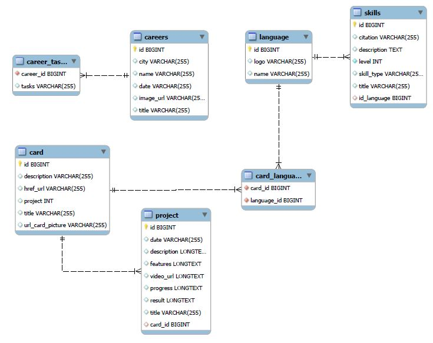

# Mon Portfolio

Ce dépôt contient le code source de mon site portfolio, construit avec Angular pour le front-end et Spring Boot pour le back-end.

## Table des matières

- [Aperçu](#aperçu)
- [Technologies utilisées](#technologies-utilisées)
- [Prérequis](#prérequis)
- [Installation](#installation)
  - [Cloner le dépôt](#cloner-le-dépôt)
  - [Installation du front-end Angular](#installation-du-front-end-angular)
  - [Installation du back-end Spring Boot](#installation-du-back-end-spring-boot)
  - [Création de la base de données](#création-de-la-base-de-données)
- [Utilisation](#utilisation)
  - [Démarrer l'application Angular](#démarrer-lapplication-angular)
  - [Démarrer l'application Spring Boot](#démarrer-lapplication-spring-boot)
- [Structure du projet](#structure-du-projet)
  - [Organisation](#organisation)
  - [Schéma de base de donnée](#schéma-de-base-de-donnée)

## Aperçu

Ce projet est une application web portfolio permettant de présenter mes projets, mon expérience et mes compétences. Le front-end est développé en Angular, et le back-end est un API REST construit avec Spring Boot.

## Technologies utilisées

- **Front-end** : Angular, TypeScript, HTML, CSS
- **Back-end** : Spring Boot, Java
- **Base de données** : MySQL

## Prérequis

Avant de commencer, assurez-vous d'avoir les éléments suivants installés :

- [Node.js](https://nodejs.org/) (version 16 ou supérieure)
- [Angular CLI](https://angular.io/cli) (version 12 ou supérieure)
- [Java JDK](https://www.oracle.com/java/technologies/javase-jdk11-downloads.html) (version 11 ou supérieure)
- [Maven](https://maven.apache.org/) (pour le build de Spring Boot)


## Installation

### Cloner le dépôt

```bash
git clone https://github.com/Louis-Philippe86/myPortFolio.git
````

### Installation du front-end Angular
```bash
cd myPortFolio/frontend
npm install
````
### Installation du back-end Spring Boot
```bash
cd myPortFolio/backend
mvn clean install
````
### Création de la base de données
- Utilisez le script pour creer la base de donnée

Répertoire :  _myPortFolio/script_

- Configurez votre base de données dans le fichier application.properties.

Répertoire :  _myPortFolio/backend/src/main/ressources_

```bash
spring.datasource.url=jdbc:mysql://localhost:5000/data_base_name
spring.datasource.username=username
spring.datasource.password=password_user
````

## Utilisation
### Démarrer l'application Angular
- Assurez-vous que vous êtes dans le répertoire frontend.
- Démarrez le serveur de développement Angular :
```bash
cd myPortFolio/frontend
ng-serve
````
### Démarrer l'application Spring Boot
- Assurez-vous que vous êtes dans le répertoire backend.
```bash
cd myPortFolio/backend
mvn spring-boot:run
````

## Structure du projet
### Organisation
- myPortFolio/frontend  : Contient le code source Angular.
- myPortFolio/backend : Contient le code source Spring Boot

### Schéma de base de donnée
